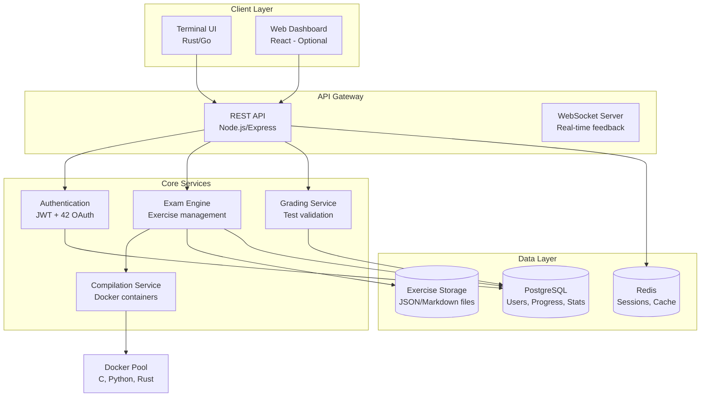
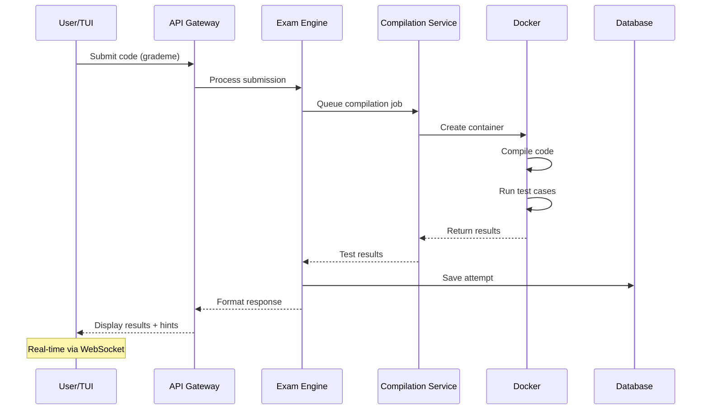

# Architecture Overview

## System Architecture

```mermaid
graph TB
    subgraph "Client Layer"
        TUI[Terminal UI<br/>Rust/Go]
        WEB[Web Dashboard<br/>React - Optional]
    end
    
    subgraph "API Gateway"
        GW[REST API<br/>Node.js/Express]
        WS[WebSocket Server<br/>Real-time feedback]
    end
    
    subgraph "Core Services"
        AUTH[Authentication<br/>JWT + 42 OAuth]
        EXAM[Exam Engine<br/>Exercise management]
        COMPILE[Compilation Service<br/>Docker containers]
        GRADE[Grading Service<br/>Test validation]
    end
    
    subgraph "Data Layer"
        DB[(PostgreSQL<br/>Users, Progress, Stats)]
        REDIS[(Redis<br/>Sessions, Cache)]
        EXERCISES[(Exercise Storage<br/>JSON/Markdown files)]
    end
    
    TUI --> GW
    WEB --> GW
    GW --> AUTH
    GW --> EXAM
    GW --> GRADE
    EXAM --> COMPILE
    EXAM --> EXERCISES
    AUTH --> DB
    EXAM --> DB
    GRADE --> DB
    GW --> REDIS
    COMPILE --> Docker[Docker Pool<br/>C, Python, Rust]
```

## User Flow

```mermaid
flowchart LR
    Start([Student starts Mithril])
    Login[Login with 42 credentials]
    Menu[Main Menu]
    Select[Select Exercise Level]
    Exercise[Get Random Exercise]
    Code[Write Code in Editor]
    Test[Run Tests Locally]
    Submit[Submit 'grademe']
    Result{Pass?}
    Next[Next Exercise]
    Stats[Update Statistics]
    End([Session Complete])
    
    Start --> Login
    Login --> Menu
    Menu --> Select
    Select --> Exercise
    Exercise --> Code
    Code --> Test
    Test --> Submit
    Submit --> Result
    Result -->|Yes| Stats
    Result -->|No| Code
    Stats --> Next
    Next --> Exercise
    Menu -->|Quit| End
```

## Data Flow

```mermaid
sequenceDiagram
    participant U as User/TUI
    participant API as API Gateway
    participant EX as Exam Engine
    participant C as Compilation Service
    participant D as Docker
    participant DB as Database
    
    U->>API: Submit code (grademe)
    API->>EX: Process submission
    EX->>C: Queue compilation job
    C->>D: Create container
    D->>D: Compile code
    D->>D: Run test cases
    D-->>C: Return results
    C-->>EX: Test results
    EX->>DB: Save attempt
    EX-->>API: Format response
    API-->>U: Display results + hints
    
    Note over U: Real-time via WebSocket
```
